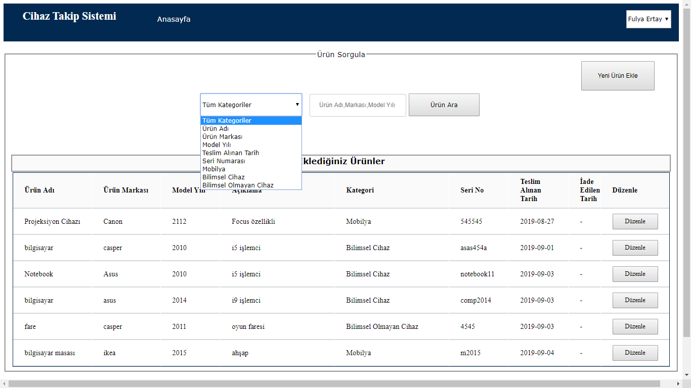

 

## Project: Device Tracking App(Internship Project)


## Visulation of the App
## Log in Screen

- 

## Filtered according to category
- 

## Filtered according to user's e-mail address
- 


## Description
```bash
- Created the device tracking application during bachelor's internship

- Developed the application that it can be used by the University employees.

- Designed using .NET, C# and MSSQL languages.

- Learned software engineering processes and best practices.
```


## Technologies 💻
```bash
- C#
- MSSQL
- ASP .NET
```

